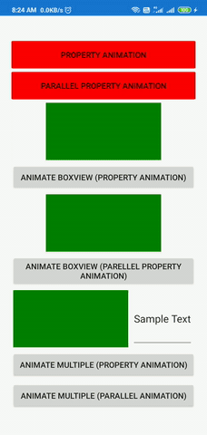

<h1># Xamarin.forms.PropertyAnimation</h1>

This is an animation library for xamarin forms controls. We can animate any property with supported type. Currenlty this library has three types which can be animated.These are double, Integer and color. So if any control has any property with these types, we can animate that.

We can download Nuget package for this library from https://www.nuget.org/packages/Xamarin.Forms.PropertyAnimation.

This library has two type of animations.

<strong>1- Sequentional.</strong>

<strong>2- Parallel.</strong>

In sequential property animation, each animation will start after completion of its previous animation but if we want to animate multiple properties simultaneously, We can use parellel property animation. Parallel property animation provides more feature including features of Sequentional property animation.

This animator has few basic properties which need to understand.

<ol>
<li><strong>StartValue</strong> : Initial value from where animation need to start:</li>
<li><strong>EndValue</strong>: Last value where animation will finish.</li>
<li><strong>PropertyName</strong>: Name of property which we want to animate.</li>
<li><strong>Target</strong>: Which control's property need to animate.  Except these properties there are few optional properties which also can be used to customize animation behaviour.  </li>
<li><strong>Toggle</strong>: This property instructs animator to reverse animation from EndValue to StartValue.</li>
<li><strong>Duration</strong>: How long animation should run.</li>
<li><strong>AnimationEasing</strong>: Animation Easing.</li>
<li><strong>Rate</strong>: Frame rate of animation.</li>
<li><strong>Delay</strong>: Not yet Implemented.</li>
</ol>
<h2> <strong>Usage:</strong></h2>

  Install Nuget package Xamarin.Forms.PropertyAnimation in shared project.     Add Reference in xaml file or C# file.    Xaml Example:    <strong>xmlns:PA="clr-namespace:Animation;assembly=Animation"</strong>    C# Example    <strong>using Animation;</strong>    After importing animation namespace, we can use animation library as following:    <strong>Xaml:</strong>

<strong>PropertyAnimation:</strong>

&lt;Button Text="Property Animation" BackgroundColor="#ffff0000" x:Name="btn" &gt;  &lt;Button.Triggers&gt;  &lt;EventTrigger Event="Clicked" &gt;  &lt;PA:PropertyAnimator Toggle="True"&gt;  &lt;PA:PropertyAnimator.PropertyAnimations &gt;  &lt;PA:ColorAnimation StartValue="#ffff0000" EndValue="#ffffff00" PropertyName="BackgroundColor" Target="{x:Reference btn}" Length="500"&gt;&lt;/PA:ColorAnimation&gt;  &lt;PA:ColorAnimation StartValue="#00000000" EndValue="#ffffffff" PropertyName="TextColor" Target="{x:Reference btn}" Length="500" &gt;&lt;/PA:ColorAnimation&gt;  &lt;/PA:PropertyAnimator.PropertyAnimations&gt;  &lt;/PA:PropertyAnimator&gt;  &lt;/EventTrigger&gt;  &lt;/Button.Triggers&gt;  &lt;/Button&gt;

&nbsp;

<strong>Parellel Property Animation:</strong>

&lt;Button Text="Parallel Property Animation" BackgroundColor="#ffff0000" x:Name="btn2" BorderColor="Black"&gt;  &lt;Button.Triggers&gt;  &lt;EventTrigger Event="Clicked" &gt;  &lt;PA:ParellelPropertyAnimator Toggle="True"&gt;  &lt;PA:ParellelPropertyAnimator.ParallelAnimations &gt;  &lt;PA:ParallelAnimation Target="{x:Reference btn2}"&gt;  &lt;PA:ParallelAnimation.PropertyAnimations &gt;  &lt;PA:ColorAnimation Target="{x:Reference btn2}" StartValue="#ff0000" EndValue="#ffff00" PropertyName="BackgroundColor" Length="100"&gt;&lt;/PA:ColorAnimation&gt;  &lt;PA:ColorAnimation Target="{x:Reference btn2}" StartValue="#ffffffff" EndValue="#000000" PropertyName="TextColor" Length="100" &gt;&lt;/PA:ColorAnimation&gt;  &lt;PA:IntegerAnimation Target="{x:Reference btn2}" StartValue="5" EndValue="25" PropertyName="CornerRadius" Length="100" &gt;&lt;/PA:IntegerAnimation&gt;  &lt;PA:DoubleAnimation StartValue="1" EndValue="5" PropertyName="BorderWidth" Length="100" Target="{x:Reference btn2}"&gt;&lt;/PA:DoubleAnimation&gt;  &lt;/PA:ParallelAnimation.PropertyAnimations&gt;  &lt;/PA:ParallelAnimation&gt;  &lt;/PA:ParellelPropertyAnimator.ParallelAnimations&gt;  &lt;/PA:ParellelPropertyAnimator&gt;  &lt;/EventTrigger&gt;  &lt;/Button.Triggers&gt;  &lt;/Button&gt;

 

&nbsp;

